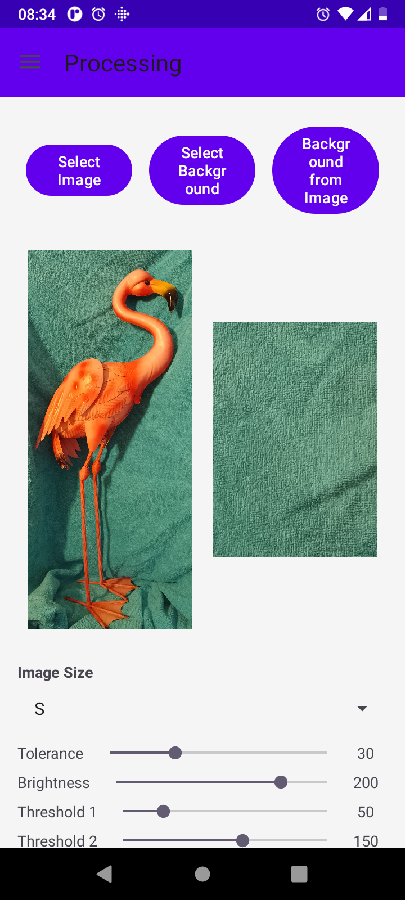
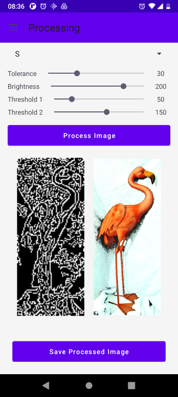
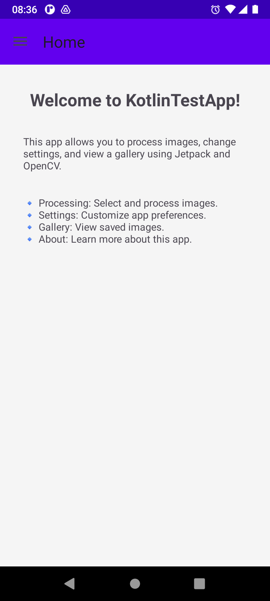
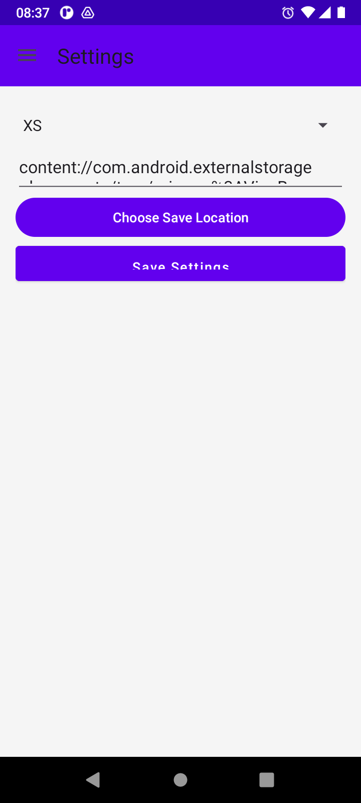

# **VisuBee - Android Image Processing with OpenCV**

## **📖 Overview**

**VisuBee** is an Android application for **image processing** using OpenCV. It allows users to:

✅ Select an input image from the gallery.  
✅ Optionally select a background image for reference.  
✅ Choose an image size (S, M, L, etc.).  
✅ Adjust processing parameters (**tolerance, brightness, edge detection, contour color**).  
✅ Process the image using OpenCV and display results.  

VisuBee is built with **Kotlin** and uses the **OpenCV Maven repository**.  
Unlike modern Jetpack Compose apps, **VisuBee follows a traditional XML-based UI approach**, using **Fragments, ViewModels, and LiveData** for UI interactions.

📚 **Documentation:** [Documentation](documentation/) for more details.  

📖 **User Manual:** [User Manual](documentation/UserManual.md)  
🛠 **Test:** [Test](documentation/Test.md)  
📑 **Specification:** [Specification](documentation/specification.md)  
📌 **Introduction to MVVM Architecture:** [Jetpack Architecture](documentation/Jetpack-Architecture.md)  
 
## 📸 Screenshots

Here is a preview of the app:
 
### 📷 Image Processing
- First choose file and background  
  

- Processed image  
  

### 🏠 Home Screen  


### ⚙️ Settings Screen  


---

## **📂 Project Structure**
``` 
extraction-app/       # Root repository for multiple projects
│── VisuBee/          # Android application (VisuBee)
│── Backend/          # (Future) Backend services
│── documentation/    # Shared documentation across projects

```

---

## **🛠️ Installation & Setup**

### **1️⃣ Prerequisites**
Ensure you have the following installed:

- **Android Studio** (Latest version)
- **Android SDK & NDK** (Ensure all dependencies are installed)
- **OpenCV (via Maven repository)**

### **2️⃣ Clone the Repository**
```bash
git clone https://github.com/nathabee/extraction-app.git
cd extraction-app
cd VisuBee
```

---

## **🚀 Running the App**
### **1️⃣ Build the Project**
```bash
./gradlew clean
./gradlew build
./gradlew assembleDebug
./gradlew installDebug
```

### **2️⃣ Run on Device or Emulator**
1. **Connect an Android device** OR **start an emulator**.
2. Open **Android Studio** and click **Run (▶)**.
3. Check **Logcat** for OpenCV initialization messages.

---

## **📸 Usage Guide**

### **1️⃣ Select an Image**
- Click **"Select Image"** to pick an image from the gallery.
- The selected image will appear in the preview.

### **2️⃣ (Optional) Select a Background**
- Click **"Select Background"** (optional) for background processing.

### **3️⃣ Adjust Processing Settings**
- **Size:** Choose between **Small (S), Medium (M), Large (L), etc.**  
- **Tolerance:** Adjust background color tolerance.  
- **Brightness:** Modify brightness level.  
- **Edge Detection:** Set **Threshold1** and **Threshold2**.

### **4️⃣ Process Image**
- Click **"Process Image"** to apply OpenCV transformations.
- The results will display:  
  - **Image with a transparent background**
  - **Image with detected edges**

### **5️⃣ Save Processed Image**
- Click **"Save Image"** to store the output in the gallery.

---

## **⚙️ Technologies Used**
- **Android Studio** – Development environment.  
- **Kotlin** – Core programming language.  
- **OpenCV** – Image processing library.  
- **Jetpack MVVM** – Architecture for better scalability.  
- **Gradle** – Build automation tool.  

---

## **📝 License**
This project is open-source under the **MIT License**.

---

## **👥 Contributors**
👤 **Nathabee** – Lead Developer  
🤖 **ChatGPT** – Assisted in architecture, logic, and documentation  

🔹 _Open to contributions! Fork the repository and submit a Pull Request (PR)._ 🚀  

---
 